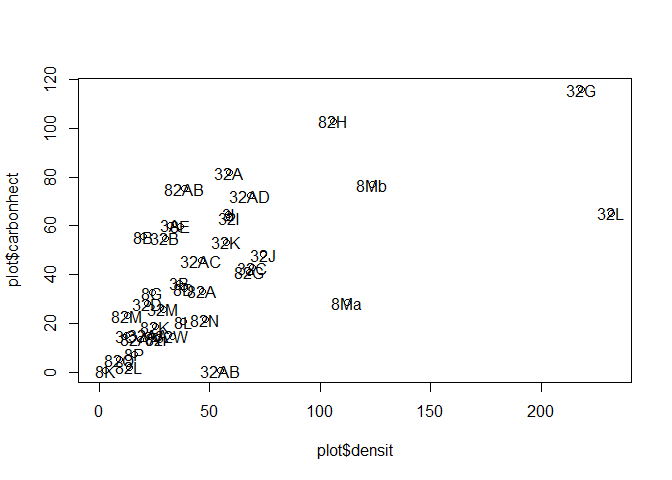

#Estimation de la biomasse aérienne des arbres associés aux cacaoyers


<!-- -->

```
## integer(0)
```

```
##     code     densit    biomhect
## 24   32A  59.154096  81.8021298
## 25  32AA  22.320000  15.0925982
## 27  32AC  46.500000  45.7471246
## 28  32AD  68.300000  72.3558904
## 29   32B  29.781602  54.9290289
## 30   32C  69.406393  42.8271867
## 31   32D  21.673891  28.1270110
## 34   32G 218.403151 100.8940709
## 36   32I  59.128930  63.4311049
## 37   32J  74.503960  48.1523417
## 38   32K  57.503394  53.2834502
## 39   32L 231.670755  65.1969879
## 40   32M  29.290519  25.9020343
## 50   32W  33.330000  14.8287012
## 54    3A  32.213845  60.2944828
## 55    3B  36.287509  36.5296535
## 56    3C  12.181617  15.0600924
## 62    3I  58.474576  64.7714474
## 89   82A  46.533827  33.2744159
## 90  82AA  18.759019  13.4592073
## 91  82AB  38.613081  75.2015512
## 97   82G  67.796610  41.0267310
## 98   82H 106.106106 102.8630352
## 99   82I  25.900000  13.7778334
## 101  82K  25.470000  18.7186091
## 102  82L  13.595482   2.1390955
## 103  82M  12.708787  23.1690798
## 104  82N  48.171793  21.4773307
## 118   8B  20.184136  55.5057279
## 120   8D  38.374718  34.3022873
## 121   8E  37.011173  59.9484024
## 123   8G  24.261603  32.5565073
## 127   8K   2.678571   0.6021546
## 128   8L  37.922317  20.7008641
## 129  8Ma 112.513304  28.5589113
## 130  8Mb 123.499142  76.8079087
## 133   8P  15.885316   7.4132162
```


#Estimation de la biomasse aérienne des cacaoyers
##Estimation de la densité des cacaoyers (nbr cacaoyers/hect)
La densité de cacaoyers n'a pas été mesurée sur les parcelles inventoriées. 

Toutefois, je dispose d'un jeu de données constitué lors de mon Master 2 (avec IDH/CIRAD/ALP). J'avais mesuré les densités de cacaoyers sur 61 parcelles de 12 à 52 ans dans l'ouest ivoirien. Sur chaque parcelle, les cacaoyers ont été comptés dans 4 carrés de 100m² (Sanial, 2015, Ruf et al., 2015). J'ai ensuite calculé la densité moyenne de ces 4 carrés pour chaque parcelle. 
Dans ce jeu de données, la relation entre âge du champ et densité peut s'écrire selon l'équation linéaire suivante : -0.15x+19.5
NB: Prendre plutôt le modèle lognormal -4.509ln(x)+29.97

Ainsi, j'ai pu estimer la densité des cacaoyers en fonction de l'âge pour chacune des parcelles inventoriées dans le cadre de me thèse. 


```r
#Ajout du cacao#
Carbonestimated<-merge(Carbonestimated,plot,"code")
#Carbonestimated$kkodensit<-(((-0.15*Carbonestimated$age_champ)+19.5)*100)
Carbonestimated$kkodensit<-(((-4.509*log(Carbonestimated$age_champ))+29.9)*100)
```

L'estimation de la densité moyenne des cacaoyers (nbr cacaoyers/hectares) (
[1] 1588.314
) est supérieure à ce qui a été mesuré par Stemler (2012): 1100 cacaoyers/hectares dans le sud Ivoirien. 

Toutefois, lors des inventaires botaniques, les portions de la parcelle n'ayant pas de cacaoyers ont été cartographiées au GPS. Cela permet de connaître le pourcentage d'espaces vides de cacaoyers par rapport à la superficie totale inventoriée. Une fois ce pourcentage pris en compte on obtient une densité de cacaoyers à l'hectare plus faible avec une moyenne de:


[1] 1477.866
 cacaoyers par hectare .

##Estimation de la biomasse aérienne des cacaoyers (tonnes/hectare)

La biomasse aérienne du cacaoyer, d'après le modèle de Zuidema et al.,(2005), représente 88.2% de la biomasse totale (d'après la compilation de différentes mesures effectuées au Brésil, Congo, Costa Rica, Malaysie, Nigeria et Vénézuela). 
La régression logarithmique entre l'âge de l'arbre et la biomasse est, toujours d'après ce modèle physiologique : 
8.46ln(x)+9.40. 

J'utilise cette équation pour estimer la biomasse des cacaoyers en prenant en compte l'âge de la plantation (compris ici, de manière schématique comme l'âge du cacaoyer). 

On obtient ainsi la biomasse totale. Pour obtenir une estimation de la biomasse aérienne pour chaque cacaoyer, il faut prendre 88.2% de la biomasse totale.


```r
Carbonestimated$kkobiomasse<-((((8.46*log(Carbonestimated$age_champ)+9.4)*88.2)/100)*Carbonestimated$kkodensitmoinsparc)/1000
#Limite de ce calcul: les données sont prises sur des plantations ombragées, donc avec plus de biomasse cacaoyère. 
```

Une autre méthode pourrait être choisie: utiliser le package BIOMASS et prendre en compte également la hauteur des caacoyers qui est fonction de l'ombrage (20 à 25m sous ombrage fort contre 3 à 10m sous ombrage léger Van Vliet (2015)). 


#Estimation de la biomasse totale et du carbone (Tonnes/hect) (arbres associés + cacaoyers)


```
##    code     densit    biomhect kkobiomasse   biomtot carbontot
## 1   32A  59.154096  81.8021298    42.89466 124.69679  62.34839
## 2  32AA  22.320000  15.0925982    44.19060  59.28319  29.64160
## 3  32AC  46.500000  45.7471246    43.73516  89.48228  44.74114
## 4  32AD  68.300000  72.3558904    46.54409 118.89998  59.44999
## 5   32B  29.781602  54.9290289    47.56529 102.49432  51.24716
## 6   32C  69.406393  42.8271867    46.87194  89.69913  44.84956
## 7   32D  21.673891  28.1270110    47.32555  75.45256  37.72628
## 8   32G 218.403151 100.8940709    42.49641 143.39048  71.69524
## 9   32I  59.128930  63.4311049    40.59528 104.02638  52.01319
## 10  32J  74.503960  48.1523417    47.17518  95.32752  47.66376
## 11  32K  57.503394  53.2834502    42.08909  95.37254  47.68627
## 12  32L 231.670755  65.1969879    41.77918 106.97617  53.48809
## 13  32M  29.290519  25.9020343    45.53706  71.43909  35.71955
## 14  32W  33.330000  14.8287012    41.76096  56.58966  28.29483
## 15   3A  32.213845  60.2944828    47.60148 107.89596  53.94798
## 16   3B  36.287509  36.5296535    42.70540  79.23505  39.61753
## 17   3C  12.181617  15.0600924    45.28921  60.34930  30.17465
## 18   3I  58.474576  64.7714474    39.95449 104.72594  52.36297
## 19  82A  46.533827  33.2744159    47.37961  80.65403  40.32701
## 20 82AA  18.759019  13.4592073    47.56529  61.02450  30.51225
## 21 82AB  38.613081  75.2015512    48.39398 123.59553  61.79776
## 22  82G  67.796610  41.0267310    45.92937  86.95610  43.47805
## 23  82H 106.106106 102.8630352    42.06054 144.92357  72.46179
## 24  82I  25.900000  13.7778334    46.74382  60.52165  30.26083
## 25  82K  25.470000  18.7186091    48.85914  67.57775  33.78887
## 26  82L  13.595482   2.1390955    48.78270  50.92179  25.46090
## 27  82M  12.708787  23.1690798    48.15822  71.32730  35.66365
## 28  82N  48.171793  21.4773307    45.89900  67.37633  33.68817
## 29   8B  20.184136  55.5057279    36.57459  92.08032  46.04016
## 30   8D  38.374718  34.3022873    48.22328  82.52556  41.26278
## 31   8E  37.011173  59.9484024    48.35544 108.30384  54.15192
## 32   8G  24.261603  32.5565073    49.22793  81.78443  40.89222
## 33   8K   2.678571   0.6021546    46.26192  46.86408  23.43204
## 34   8L  37.922317  20.7008641    42.49344  63.19430  31.59715
## 35  8Ma 112.513304  28.5589113    48.22397  76.78288  38.39144
## 36  8Mb 123.499142  76.8079087    39.32011 116.12802  58.06401
## 37   8P  15.885316   7.4132162    47.47934  54.89255  27.44628
```

```r
hist(Carbonestimated$carbontot)
```

<!-- -->

```r
boxplot(Carbonestimated$carbontot,main="Tonne de carbone/hect")
```

<!-- -->

Les parcelles étudiées stockent de
[1] 23.43204
à
[1] 72.46179
tonnes de carbone par hectare (cacaoyers+arbres associés). 

En moyenne on estime 
[1] 43.55096
(sd
[1] 12.74707
) tonnes de carbone/hectare. 

Pour indication, d'après Nijmeijer et al., (2017) une agroforêt à cacao camerounaise stocke en moyenne 72 tonnes par hectare (sd 8). 

Il convient de garder à l'esprit que l'estimation de biomasse aérienne des cacaoyers peut être sur-estimée dans notre étude: en effet les données d'observation sont issues de plantation ombragées. Dans ces conditions d'ombrage, les cacaoyers ont plus de biomasse que dans des conditions moins ombragées comme on l'observe plus couramment en Côte d'Ivoire. 

#Estimation du carbone par type d'arbres(planté, recrû,...)


<!-- --><!-- -->


#Covariance Carbone et déterminants environnementaux
##Age


<!-- -->

<!-- -->
<!-- -->

##Occupation des sols
###Bas fonds
<!-- -->

<!-- -->


<!-- -->

###Cacao
La proximité d'une cacaoyère agroforestière pourrait permettre la diffusion de certaines espèces arborées repoussant spontanément dans les cacaoyères. Ainsi, les parcelles qui se situent au milieu d'un grand bloc de cacaoyères (comme on l'observe souvent) pourraient connaître un recrû spontané plus important et plus variés que celles situées à procximité de bas fonds ou de cultures permanentes. 

<!-- -->

<!-- -->


<!-- -->

###Forêt
<!-- -->

<!-- -->

<!-- -->

#Service diversité


##Diversité Alpha, Bêta et Gamma pour q=0

```
## Diversity partitioning of order 0 of MetaCommunity Metacom
## 
## Alpha diversity of communities: 
##  12A  12B  12C  12D  12E  12F  12G  12H  12I  12J  12K  12L  12M  12N  12O 
##   17   22    8   11   15   15   25   19   33   21   10   24   17   12   24 
##  12P  12Q  12R  12S  12T  15A  15B  15C  32A 32AA 32AB 32AC 32AD  32B  32C 
##   15   22   21   11    9   15   16   19   22   14   29   19   14   10   29 
##  32D  32E  32F  32G  32H  32I  32J  32K  32L  32M  32N  32O  32P  32Q  32R 
##   17   32   22   22   10   22   24   20   30    4   25   11    8   16   25 
##  32S  32T  32U  32V  32W  32X  32Y  32Z   3A   3B   3C   3D   3E   3F   3G 
##   23   12   13   21   22   25   19   31   15   27    7   21   35   22   16 
##   3H   3I   3J   3K   3L   3M   3N   3O   3P   7A   7B   7C   7D   7E   7F 
##   27   43   22   11   18   20   21   14    9    5    2   18    5   14   16 
##   7G   7H   7I   7J   7K   7L   7M   7N   7O   7P   7Q   7R   7S  82A 82AA 
##    4    3   14   11    6    8   14    9   21    8    9   11   11   13   13 
## 82AB  82B  82C  82D  82E  82G  82H  82I  82J  82K  82L  82M  82N  82O  82P 
##   18    7   11   27    5    8    9   12   10   13    2    9   16    3   10 
##  82Q  82R  82S  82T  82U  82V  82W  82X  82Y  82Z   8A   8B   8C   8D   8E 
##    6    6   11   11   11   12   12   16   12    8   15   25   15   23   33 
##   8F   8G   8H   8I   8J   8K   8L  8Ma  8Mb   8N   8O   8P   8Q   8R   8S 
##   10   11   21   13   16    3   15   24   17    8   10    9    7    9    7 
##   8T 
##   11 
## Total alpha diversity of the communities: 
## [1] 15.45588
## Beta diversity of the communities: 
##     None 
## 10.74025 
## Gamma diversity of the metacommunity: 
## None 
##  166 
## Quantiles of simulations (alpha, beta and gamma diversity):
##       0%       1%     2.5%       5%      10%      25%      50%      75% 
## 15.24199 15.24199 15.26018 15.27838 15.31404 15.39640 15.44787 15.52140 
##      90%      95%    97.5%      99%     100% 
## 15.58757 15.61993 15.71018 15.74941 15.75669 
##       0%       1%     2.5%       5%      10%      25%      50%      75% 
## 10.13201 10.21932 10.27105 10.32191 10.41879 10.55298 10.74614 10.94669 
##      90%      95%    97.5%      99%     100% 
## 11.02681 11.08535 11.14021 11.19277 11.25604 
##      0%      1%    2.5%      5%     10%     25%     50%     75%     90% 
## 154.730 157.700 158.205 159.680 161.630 163.480 165.730 169.730 170.730 
##     95%   97.5%     99%    100% 
## 171.730 171.730 171.740 172.730
```

<!-- -->


##Diversité Alpha, Bêta et Gamma pour q=2


```
## Diversity partitioning of order 2 of MetaCommunity Metacom
## 
## Alpha diversity of communities: 
##       12A       12B       12C       12D       12E       12F       12G 
## 13.517241 15.428571  4.070423  6.250000  5.261346  7.142857  8.935149 
##       12H       12I       12J       12K       12L       12M       12N 
## 10.645570  9.513866 12.051793  5.555556 14.670659  6.026786  4.704467 
##       12O       12P       12Q       12R       12S       12T       15A 
##  5.754425  6.458599 14.237037  3.927119  8.100000  7.200000 11.755556 
##       15B       15C       32A      32AA      32AB      32AC      32AD 
##  9.876543 10.666667  6.293706 10.593220  9.969231 11.571429  5.345455 
##       32B       32C       32D       32E       32F       32G       32H 
##  5.027586 13.187215 10.903226 14.635581 16.021978  3.892259  4.878049 
##       32I       32J       32K       32L       32M       32N       32O 
## 16.643564 14.123631  9.707865 10.946970  1.478702  7.389011  7.666667 
##       32P       32Q       32R       32S       32T       32U       32V 
##  7.363636 12.894737 14.628571 12.363995  3.313376  6.763380  5.576398 
##       32W       32X       32Y       32Z        3A        3B        3C 
## 14.485714 14.626087  8.865248 18.213439  6.179021 11.716216  4.281553 
##        3D        3E        3F        3G        3H        3I        3J 
##  7.993800  8.150028 10.897751 12.041667 15.363636 17.633333 14.285714 
##        3K        3L        3M        3N        3O        3P        7A 
##  2.282632  6.764588  9.197597  5.174917  4.898004  3.125000  5.000000 
##        7B        7C        7D        7E        7F        7G        7H 
##  1.246154  9.382979  5.000000 11.764706  1.246883  3.769231  3.000000 
##        7I        7J        7K        7L        7M        7N        7O 
## 10.795918 10.285714  5.444444  3.841270  5.776000  8.333333 11.982249 
##        7P        7Q        7R        7S       82A      82AA      82AB 
##  2.716981  2.816626  7.442478  4.130073  4.738318  6.259259  7.297872 
##       82B       82C       82D       82E       82G       82H       82I 
##  5.666667  6.322581  5.291272  3.200000  1.611150  1.808757 10.125000 
##       82J       82K       82L       82M       82N       82O       82P 
##  7.474576  9.986301  1.165517  5.444444  5.524459  2.333333  4.263158 
##       82Q       82R       82S       82T       82U       82V       82W 
##  5.121212  4.411765  8.018182  7.246575  5.225806  6.428571  4.750000 
##       82X       82Y       82Z        8A        8B        8C        8D 
##  7.229508  7.124629  6.000000 10.880597 12.852459  4.264654  9.285141 
##        8E        8F        8G        8H        8I        8J        8K 
## 20.362764  4.300813  4.426778  8.237537  6.223529  8.399240  3.000000 
##        8L       8Ma       8Mb        8N        8O        8P        8Q 
##  8.187970 16.297619 10.622951  7.363636  1.633281  4.595166  2.651376 
##        8R        8S        8T 
##  3.740933  3.920000  3.996330 
## Total alpha diversity of the communities: 
## [1] 5.391785
## Beta diversity of the communities: 
##     None 
## 3.574255 
## Gamma diversity of the metacommunity: 
##     None 
## 19.27162 
## Quantiles of simulations (alpha, beta and gamma diversity):
##       0%       1%     2.5%       5%      10%      25%      50%      75% 
## 5.034385 5.106221 5.135050 5.194422 5.222711 5.294955 5.394849 5.495461 
##      90%      95%    97.5%      99%     100% 
## 5.573189 5.609982 5.637613 5.672636 5.689667 
##       0%       1%     2.5%       5%      10%      25%      50%      75% 
## 3.330508 3.335380 3.350172 3.383020 3.416038 3.486344 3.568693 3.668781 
##      90%      95%    97.5%      99%     100% 
## 3.724824 3.781537 3.816650 3.821512 3.919297 
##       0%       1%     2.5%       5%      10%      25%      50%      75% 
## 16.76706 17.94482 18.24595 18.49025 18.60714 18.93269 19.32726 19.68086 
##      90%      95%    97.5%      99%     100% 
## 20.08145 20.18868 20.26511 20.40233 20.45798
```

<!-- -->


##Diversité Alpha, Bêta et Gamma pour les arbres spontanés

<!-- -->


Observation de la covariance entre diversité et carbone: est-ce que plus la parcelle est diverse, plus elle stocke de carbone?


```
## 
## Call:
## lm(formula = plot$q0al ~ plot$carbontot)
## 
## Residuals:
##      Min       1Q   Median       3Q      Max 
## -16.1730  -5.3959  -0.5101   5.7214  23.4149 
## 
## Coefficients:
##                Estimate Std. Error t value Pr(>|t|)  
## (Intercept)      5.0269     4.8587   1.035   0.3079  
## plot$carbontot   0.2780     0.1072   2.594   0.0138 *
## ---
## Signif. codes:  0 '***' 0.001 '**' 0.01 '*' 0.05 '.' 0.1 ' ' 1
## 
## Residual standard error: 8.198 on 35 degrees of freedom
##   (100 observations deleted due to missingness)
## Multiple R-squared:  0.1612,	Adjusted R-squared:  0.1373 
## F-statistic: 6.728 on 1 and 35 DF,  p-value: 0.01377
```

<!-- -->

Observation de la covariance entre carbone stocké par le recrû spontané et diversité de ce recrû


```
## 
## Call:
## lm(formula = plot$q0alsp ~ plot$carbrec)
## 
## Residuals:
##     Min      1Q  Median      3Q     Max 
## -11.743  -4.319  -2.178   2.915  17.602 
## 
## Coefficients:
##              Estimate Std. Error t value Pr(>|t|)    
## (Intercept)    5.0635     1.8492   2.738 0.010005 *  
## plot$carbrec   0.4417     0.1187   3.723 0.000757 ***
## ---
## Signif. codes:  0 '***' 0.001 '**' 0.01 '*' 0.05 '.' 0.1 ' ' 1
## 
## Residual standard error: 6.732 on 32 degrees of freedom
##   (103 observations deleted due to missingness)
## Multiple R-squared:  0.3022,	Adjusted R-squared:  0.2804 
## F-statistic: 13.86 on 1 and 32 DF,  p-value: 0.0007574
```

<!-- -->


#Covariance Diversité et déterminants environnementaux
##Densité/Diversité
<!-- -->

##Age

<!-- -->

<!-- -->

##Occupation des sols: effet sur le recrû spontané
###Bas fonds
<!-- -->


###Cacao

```
## 
## Call:
## lm(formula = plot$q0alsp ~ plot$kko)
## 
## Residuals:
##     Min      1Q  Median      3Q     Max 
## -12.298  -3.905  -1.668   2.389  24.294 
## 
## Coefficients:
##             Estimate Std. Error t value Pr(>|t|)    
## (Intercept)  0.62697    2.23918    0.28     0.78    
## plot$kko     0.14015    0.03192    4.39 3.24e-05 ***
## ---
## Signif. codes:  0 '***' 0.001 '**' 0.01 '*' 0.05 '.' 0.1 ' ' 1
## 
## Residual standard error: 6.301 on 85 degrees of freedom
##   (50 observations deleted due to missingness)
## Multiple R-squared:  0.1849,	Adjusted R-squared:  0.1753 
## F-statistic: 19.28 on 1 and 85 DF,  p-value: 3.237e-05
```

<!-- -->

###Forêt
<!-- -->

###Autres cultures permanentes en monoculture (palmier, hévéa, teck etc...)

<!-- -->

##Relief

###Altitude

<!-- -->

###Pente

<!-- -->

#Conclusion

Les éléments qui ont retenu mon attention:

- la variable "kko" (% de superficie occupée par des cacaoyères dans un rayon de 300m autour de la parcelle inventoriée) semble covarier positivement avec la variable carbone total (carbontot) et la variable diversité alpha d'ordre 0 du recrû spontané (q0alsp). 

- la variable "per" (% de superficie occupée par des cultures permanentes (monocultures) dans un rayon de 300m autour de la parcelle inventoriée) semble covarier négativement avec la variable diversité. 

- distribution d'apparence normale autour de la variable altitude

- pas d'effet apparent de la pente sur la diversité

#Valeurs d'usage


Méthode: Lors des inventaires botaniques les usages faits des arbres par le propriétaire du champ ont été relevés. Ceux qui sont traités dans cette partie sont les principaux à savoir: 
alimentaire (domestique et commercial), bois d'oeuvre (domestique et commercial), service agronomique aux cacaoyers (fertilisation, ombrage,...), symbolique (spirituel, beauté, mémoire de pratiques traditionnelles), médicinal, tuteur pour l'igname, fourrage, artisanat et latex. 

Ainsi, un Akpi peut être utilisé par un Baoulé comme arbre alimentaire et par un autre planteur comme arbre médicinal et enfin par un troisième comme futur arbre à bois. 
Ainsi, un même arbre peut avoir différents usages d'une parcelle à l'autre ou cumuler plusieurs usages sur une même parcelle. 

Deux valeurs d'usage ont été attribuées aux parcelles: 

- une première, appelée "valeur d'usages réels" fait la somme des usages qui sont faits pour chaque arbre. Par exemple un Akpi utilisé par un planteur comme arbre alimentaire et médicinal aurait une note de 2.
Ces valeurs sont ensuite additionnées pour obtenir une note à l'échelle de la parcelle. Cette note est ensuite pondérée par la supercifie. On obtient donc un nombre d'usages (correspond donc à la somme des usages/arbres) par hectare. 
Cette note d'usage réelle reflète les connaissances et les pratiques des producteurs. Elle peut également être déclinée par type d'usage. Par exemple, chaque parcelle peut avoir une valeur correspondant au % d'arbres alimentaires sur le total des usages recensés sur cette même parcelle. Cela permet d'identifier certaines spécialisations.

- La deuxième valeur est appelée "valeur d'usages potentiels". Elle représente la somme des usages qui pourraient être faits sur une parcelle à partir de tous les usages recensés pour une essence donnée. 
Par exemple, l'Akpi fait l'objet de 4 usages différents: alimentaire, médicinal, service agronomique aux cacaoyers et bois d'oeuvre. Systèmatiquement, cet arbre a une valeur de 4. 
Certains producteurs ont des arbres qui peuvent faire l'objet d'usages médicinaux qu'ils ne connaissent pas mais qui sont pratiqués par d'autres producteurs. Cette note de valeur d'usages potentiels reflète la diversité des arbres introduits et peut également être déclinée par type d'usages.

Dans cette partie, les services environnementaux mesurés (carbone et diversité) sont confrontés à ces différents usages. L'objectif étant d'identifier les usages qui permettent de maximiser chacun de ces services et un compromis entre diversité d'usages, biodiversité et stockage de carbone. 

Pour l'instant, la méthode est plutôt descriptive et mérite d'être affinée. 

##Valeurs d'usages réels (totales et par type d'usages)


<!-- --><!-- -->

Relation entre diversité et type d'usages (nbr d'arbres/hect):


<!-- -->

<!-- -->


<!-- -->

<!-- -->

Relation entre diversité et type d'usages (% arbres d'un usage donné sur l'ensemble des arbres):


<!-- -->

<!-- -->


###Quelle est la spécialisation réelle qui maximise la diversité (à l'échelle de la parcelle)?  


<!-- -->


Comparaison des différents usages:

<!-- -->

<!-- -->

###Quelle est la spécialisation réelle qui maximise le nombre d'arbres/hect (à l'échelle de la parcelle)?

<!-- -->

<!-- -->

###Quelle est la spécialisation réelle qui maximise la biomasse (à l'échelle de la parcelle)?

<!-- -->

<!-- -->

##Identification des arbres multifonctionnels (cumulant plusieurs utilisations possibles)


Les arbres multifonctionnels (au moins deux usages pratiqués sur la même parcelle):


```
##               Genre         Espèce
## 35       Anthonotha       fragrans
## 40        Heritiera         utilis
## 50        Spathodea    campanulata
## 51         Vernonia       colorata
## 53           Acacia        mangium
## 58         Antiaris       africana
## 59    Ricinodendron     heudelotii
## 60            Ficus       capensis
## 61       Anacardium    occidentale
## 63       Artocarpus        altilis
## 64           Persea      americana
## 65          Lophira          alata
## 67       Andansonia       digitata
## 74         Mansonia      altissima
## 79                                
## 82          Xylopia     aethiopica
## 83           Citrus          limon
## 84           Cassia         siamea
## 85            Cocos       nucifera
## 86             Cola         nitida
## 88           Annona       muricata
## 89  Piptadeniastrum      africanum
## 92            Ficus        goliath
## 94           Celtis    mildbraedii
## 97            Ficus         mucoso
## 100        Alstonia         boonei
## 101                               
## 104       Diospyros     macrocarpa
## 107      Strombosia      pustulata
## 108           Ficus               
## 109        Monodora      myristica
## 110      Terminalia        superba
## 111      Terminalia      ivorensis
## 112           Ceiba      pentandra
## 113         Blighia         sapida
## 116       Rauwolfia       vomitora
## 117    Margaritaria      discoidea
## 120      Gliricidia         sepium
## 127         Psidium        guajava
## 130           Hevea   brasiliensis
## 132      Pycnanthus      angolense
## 133         Milicia        excelsa
## 134           Morus      mesozygia
## 138                               
## 145    Nesogordonia     papavifera
## 146       Pterygota     macrocarpa
## 147       Sterculia    tragacantha
## 151         Morinda         lucida
## 153        Albizzia          zygia
## 154        Amphimas pterocarpoides
## 155          Lannea     welwitchii
## 157          Citrus      tachibana
## 158       Mangifera         indica
## 160        Spondias         monbin
## 161         Moringa       oleifera
## 163          Parkia      biglobosa
## 172          Citrus       sinensis
## 176          Citrus         maxima
## 178         Musanga   cecropioides
## 182       Picralima         nitida
## 183        Glyphaea         brevis
## 184      Afrormosia      laxiflora
## 185        Funtumia       elastica
## 186        Syzygium     malaccense
## 187          Bombax   buonopozense
## 188          Parkia        bicolor
## 191        Bridelia     ferruginea
## 192    Triplochiton    scleroxylon
## 195           Trema     orientalis
## 196 Entandrophragma          utile
## 199      Tamarindus         indica
## 200         Tectona        grandis
## 202 Entandrophragma      angolense
## 203                               
## 205      Myrianthus       arboreus
## 207      Newbouldia         laevis
## 208        Treculia       africana
## 213    Anthocleista        nobilis
## 215           Ficus     exasperata
```

##Valeurs d'usages potentiels


<!-- --><!-- --><!-- -->


<!-- -->

<!-- -->


```
## `geom_smooth()` using method = 'loess'
```

<!-- -->

<!-- -->


```
## `geom_smooth()` using method = 'loess'
```

<!-- -->


```
## `geom_smooth()` using method = 'loess'
```

<!-- -->


###Quelle est la spécialisation potentielle qui pourrait maximiser la diversité (à l'échelle de la parcelle)?  


<!-- -->


```
## `geom_smooth()` using method = 'loess'
## `geom_smooth()` using method = 'loess'
## `geom_smooth()` using method = 'loess'
## `geom_smooth()` using method = 'loess'
## `geom_smooth()` using method = 'loess'
```

<!-- -->


<!-- -->

###Quelle est la spécialisation potentielle qui pourrait maximiser le nombre d'arbres/hect?

<!-- -->

<!-- -->

###Quelle est la spécialisation potentielle qui pourrait maximiser la biomasse (à l'échelle de la parcelle)?

<!-- -->

<!-- -->

#Conclusion

Arbres médicinaux et arbres fournissant un service agronomique aux cacaoyers semblent être ceux qui introduisent plus de diversité dans les parcelles. A l'inverse, arbres alimentaires sont moins divers mais induisent de plus fortes densités d'arbres à l'hectare. Enfin, les arbres à bois induisent de faibles densités à l'hectare mais une biomasse souvent importante. 

Ces analyses doivent maintenant être incluses dans des approches multivariées plus fidèles à la réalité. En effet, il y a deux limites à ces graphiques: 

- régression de loess: très fluctuantes et peu lisibles

- régression linéaire : elles tendent vers l'infini ce qui n'est pas réaliste et elles ont des intervals de confiance très étendu, témoignant d'une inadéquation du modèle au phénomène. 

Il faudrait également pondérer ces analyses par la densité. Ex: une parcelle avec seulement 3 arbres/hectare qui sont 3 arbres à bois va présenter 100% d'arbres à bois mais une très faible diversité. Ainsi, elle introduit un biais dans l'analyse. Cette parcelle existe et explique la chute de la courbe de loess représentant l'usage bois d'oeuvre sur le graphique diversité. 

